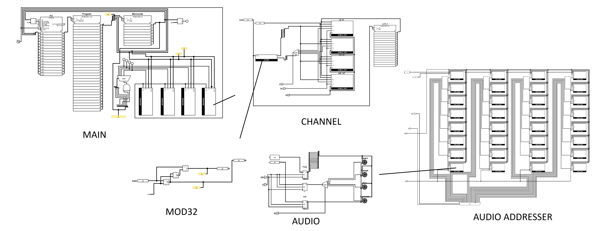

# asac

A Simple Audio Chip (ASAC) is a simple chip in which we can write programs that
mimics the [MIDI format](https://en.wikipedia.org/wiki/MIDI).



- Supports 4 channels
- Each instruction takes exactly 1 clock cycle except `WAIT` (expands into
  multiple `NOOP`).

# Demo

[ASAC v1 | Gate Of Steiner (loud alert)](http://www.youtube.com/watch?v=_kRC-5GoDq0 "ASAC v1 | Gate Of Steiner (loud alert)")

[](http://www.youtube.com/watch?v=_kRC-5GoDq0 "ASAC v1 | Gate Of Steiner (loud alert)")

# "Hello World" example

```asm
LABEL start
    NOTEON 1 65 100
    WAIT 2
    NOTEOFF 1 65

    NOTEON 2 66 100
    WAIT 2
    NOTEOFF 2 66

    NOTEON 3 67 100
    WAIT 2
    NOTEOFF 3 67

    NOTEON 4 68 100
    WAIT 2
    NOTEOFF 4 68

    JUMP start
```

I have not planned on adding conditional jumps (as in jump when note on channel
X is on/off) yet. This is purely intented as a simple target for simple audio
descriptions such as the MIDI format or most
[DAW](https://en.wikipedia.org/wiki/Digital_audio_workstation).

# Notes

There are 128 addressable audio output (0 to 127), the frequency follows:

$$f(i) = 440 Hz \times 2^{(i-69)/12}$$

# Instruction Set

```
    8 bit           8 bits        8bits        8 bits
NOTEON  [chan]   [ note 0-127 ][     vel    ]
NOTEOFF [chan]
WAIT             [          delay           ]
JUMP             [          label           ]
NOOP
```

# Microcode Spec

```
microcode
opcode       
  0x00: 0x28 (0b00101000) => pick chan 1, unset
  0x01: 0x29 (0b00101001) => pick chan 2, unset
  0x02: 0x2a (0b00101010) => pick chan 3, unset
  0x03: 0x2c (0b00101100) => pick chan 4, unset
  0x04: 0x38 (0b00111000) => pick chan 1, set
  0x05: 0x39 (0b00111001) => pick chan 2, set
  0x06: 0x3a (0b00111010) => pick chan 3, set
  0x07: 0x3c (0b00111100) => pick chan 4, set
                  ^^^
                  ||+ -- enable
                  |+ --- on/off speaker
                  +----- set kind flag (always 0 on other micro-instructions)
  0x08: 0xde (0b11011110) => wait by 'value' amount
  0x09: 0x42 (0b01000010) => jump to 'value' addr
```
